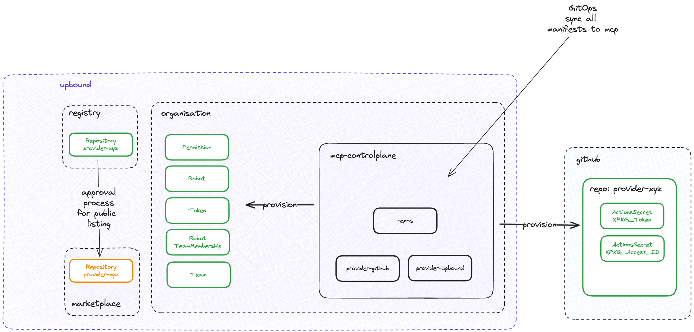

# Crossplane Configuration for Upbound Marketplace Push Token and GitHub Repo Creation

This repository contains a Crossplane configuration that automates the creation of all necessary resources for publishing `configurations`, `providers` or `functions` on the Upbound Marketplace and creating a GitHub repository (in specified GitHub Org) with action secrets (`XPKG_ACCESS_ID`, `XPKG_TOKEN`) for managing the Marketplace publish.
Keep in mind that if you want to list a provider, configuration, or function on the marketplace, you'll need approval from Upbound. However, you can push it to the registry without needing approval.

## Architecture


## Prerequisites
Before you get started, ensure that you have the following prerequisites in place:

- An Upbound Organisation
- Upbound MCP ControlPlane
- Upbound Credentials
- Github Token (with Scope for Secrets and Variables, Repo Read/Write)

## Run

This configuration provisions the following:

Upbound:
- robot
- robotteammembership
- team
- token
- repository
- permission

Github:
- repository
- actionssecret
- actionssecret

```bash
kubectl get managed

NAME                                                               READY   SYNCED   EXTERNAL-NAME                 AGE
actionssecret.actions.github.upbound.io/provider-xyz-8hc2v-bq5qc   True    True     provider-xyz:XPKG_ACCESS_ID   2m28s
actionssecret.actions.github.upbound.io/provider-xyz-8hc2v-vngqd   True    True     provider-xyz:XPKG_TOKEN       2m28s

NAME                                            READY   SYNCED   EXTERNAL-NAME                          AGE
robot.iam.upbound.io/provider-xyz-8hc2v-5jxft   True    True     64d0da30-6c54-474a-8f70-0e1f84d40095   2m28s

NAME                                                          READY   SYNCED   EXTERNAL-NAME   AGE
robotteammembership.iam.upbound.io/provider-xyz-8hc2v-4qq8c   True    True                     2m28s

NAME                                           READY   SYNCED   EXTERNAL-NAME                          AGE
team.iam.upbound.io/provider-xyz-8hc2v-45ql7   True    True     3b020dbb-787a-4219-8c9b-d08c654e137f   2m28s

NAME                                            READY   SYNCED   EXTERNAL-NAME                          AGE
token.iam.upbound.io/provider-xyz-8hc2v-x5bfk   True    True     2ecfd951-198d-4c5a-9a4e-07cfe8bdb260   2m28s

NAME                                                         READY   SYNCED   EXTERNAL-NAME   AGE
repository.repo.github.upbound.io/provider-xyz-8hc2v-tvv59   True    True     provider-xyz    2m28s

NAME                                                        READY   SYNCED   EXTERNAL-NAME   AGE
permission.repository.upbound.io/provider-xyz-8hc2v-zxd78   True    True     provider-xyz    2m28s

NAME                                                        READY   SYNCED   EXTERNAL-NAME   AGE
repository.repository.upbound.io/provider-xyz-8hc2v-dmrzc   True    True     provider-xyz    2m28s
```